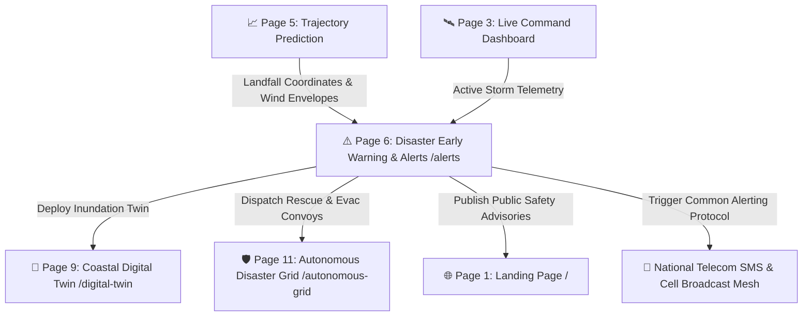

# ⚠️ CYCLO-AI: Page 6 — Disaster Early Warning & Coastal Alert Hub (`/alerts`)

**Project Topic:**  
> *"To develop an Artificial Intelligence (AI) / Machine Learning (ML) based system for identification, classification, and prediction of different tropical cyclone patterns using multi-source satellite data."*

**Document Scope:** Complete Architectural, Technical, Operational, and Decision-Support Specification of **Page 6: Disaster Early Warning & Coastal Alert Hub**.

---

## 🗺️ 1. Navigation Flow & System Context

Page 6 is the emergency decision-support center of CYCLO-AI, tailored for the **National Disaster Management Authority (NDMA)**, **State Disaster Management Authorities (SDMA)**, and district magistrates. It converts raw meteorological trajectories from **Page 5 (`/forecast`)** into actionable life-safety warnings, district vulnerability tables, multi-lingual public bulletins, and Common Alerting Protocol (CAP) emergency cell broadcasts.



---

## 📐 2. Visual Layout & Wireframe Architecture

The alert hub adopts an emergency operations center (EOC) layout: **Top IMD 4-Stage Alert Banner**, **Left Coastal Inundation & Critical Infrastructure Map**, and **Right District Impact Matrix with CAP Emergency Broadcast Dispatcher**.

```
┌──────────────────────────────────────────────────────────────────────────────────────────────────────────────────┐
│ [CYCLO-AI ALERTS] [Storm: MOCHA] [State: Odisha & West Bengal ▼] [Auth: 🛡️ NDMA Officer #4812] [🚨 LIVE WARNING]  │
├──────────────────────────────────────────────────────────────────────────────────────────────────────────────────┤
│ 🟡 STAGE 1: WATCH (-72h) │ 🟠 STAGE 2: ALERT (-48h) │ 🔴 STAGE 3: WARNING (-24h) [ACTIVE] │ 🟣 STAGE 4: OUTLOOK   │
│ Issued: 06:00 IST | Next Bulletin in: 02h 45m | Landfall Expected: Tomorrow 18:30 IST | Surge: +3.2m             │
├─────────────────────────────────────────────────────────────────────────────────┬────────────────────────────────┤
│ ┌─────────────────────────────────────────────────────────────────────────────┐ │ 📋 DISTRICT-LEVEL IMPACT MATRIX │
│ │ 🌊 COASTAL INUNDATION & INFRASTRUCTURE MAP                                  │ │ 🔍 Filter District: [Puri    ]│
│ │                                                                             │ │ ┌──────────┬──────┬─────┬─────┐│
│ │                  (Bay of Bengal Surge Zone)                                 │ │ │ District │ Wind │Rain │Evac ││
│ │                                                                             │ │ ├──────────┼──────┼─────┼─────┤│
│ │         [🏥 District General Hospital: Flood Risk 1.4m]                     │ │ │ Puri     │210km │340mm│🔴IMM││
│ │                                                                             │ │ │ Jagatsing│185km │280mm│🔴IMM││
│ │         [⚡ Power Substation 33kV: Vulnerable]                               │ │ │ Kendrapar│160km │220mm│🟠HIGH││
│ │                                                                             │ │ │ Balasore │120km │150mm│🟡STN││
│ │         [═══ National Highway 316: Rerouting Suggested]                     │ │ └──────────┴──────┴─────┴─────┘│
│ │                                                                             │ │ [🚨 Trigger District Evacuation]│
│ │    Contours: [0.5m: Cyan] [1.5m: Amber] [3.0m: Red] [5.0m: Magenta]          │ ├────────────────────────────────┤
│ └─────────────────────────────────────────────────────────────────────────────┘ │ 📱 EMERGENCY BROADCAST (CAP)   │
│ ┌─────────────────────────────────────────────────────────────────────────────┐ │ ┌────────────────────────────┐ │
│ │ 📄 MULTI-LINGUAL AUTOMATED BULLETIN GENERATOR                               │ │ │ CAP-XML SMS BROADCAST      │ │
│ │ Language: [English ▼] [हिंदी] [বাংলা] [ଓଡ଼ିଆ] [தமிழ்] [తెలుగు] [ગુજરાતી]     │ │ │ [🔴 EXTREME WARNING: MOCHA]│ │
│ │                                                                             │ │ │ "Super Cyclone approaching │ │
│ │ "Very Severe Cyclonic Storm 'MOCHA' to cross Puri Coast tomorrow evening.   │ │ │  Puri. Evacuate to Shelter │ │
│ │ Total evacuation of low-lying coastal belts within 5 km mandated."          │ │ │  immediately. Call 1078."  │ │
│ │                                                                             │ │ └────────────────────────────┘ │
│ │ [ 📥 Download Official PDF Bulletin ]   [ 🖨️ Print Disaster Dispatch ]      │ │ [ 📡 Send Cell Broadcast Test]│
└─────────────────────────────────────────────────────────────────────────────────┴────────────────────────────────┘
```

---

## 🧩 3. Section-by-Section Feature Specifications

### Section A: Official IMD 4-Stage Warning Banner
* **Component ID:** `#imd-warning-banner`
* **Styling:** Top full-width banner structured according to the India Meteorological Department cyclone alert protocol:
  1. 🟡 **Stage 1 — Cyclone Watch (Yellow):** Issued $72\text{ hours}$ before commencement of adverse weather. Informs state machinery to monitor developments.
  2. 🟠 **Stage 2 — Cyclone Alert (Orange):** Issued $48\text{ hours}$ prior to coastal arrival. Triggers initial coastal community mobilization.
  3. 🔴 **Stage 3 — Cyclone Warning (Red):** Issued $24\text{ hours}$ prior to landfall. Mandates active mass evacuations and closure of schools, ports, and airports.
  4. 🟣 **Stage 4 — Post-Landfall Outlook (Purple):** Issued $12\text{ hours}$ before landfall until storm moves inland, warning of severe inland gales and flooding.
* **Operational Telemetry:**
  * Active stage indicator with blinking status ring.
  * Time elapsed since last bulletin and countdown clock to the next mandated update ($3\text{h}$ cycles).

---

### Section B: District-Level Impact & Vulnerability Matrix
* **Component ID:** `#district-impact-table`
* **Features:**
  * Real-time sorting and filtering by State (*Odisha, West Bengal, Andhra Pradesh, Tamil Nadu, Gujarat*).
  * **Dynamic Table Columns:**
    * **District Name:** Coastal target districts (e.g., *Puri, Jagatsinghpur, Kendrapara, Bhadrak, Balasore*).
    * **Severity Badge:** Red (Catastrophic $\ge 180\text{ km/h}$), Orange (Severe $120-179\text{ km/h}$), Yellow (Moderate $60-119\text{ km/h}$).
    * **Projected Peak Wind Gusts ($km/h$):** Estimated localized gusts at coastal boundaries.
    * **24-Hour Cumulative Rainfall ($mm$):** Extreme precipitation estimates ($>300\text{ mm}$ triggers flash flood warnings).
    * **Storm Surge Height ($m$):** Combined astronomical tide and wind-driven sea surge ($+1.5\text{m}$ to $+5.0\text{m}$).
    * **Evacuation Priority Score:** Calculated priority: `🔴 IMMEDIATE` (0-5 km coastal zone), `🟠 HIGH` (5-10 km zone), `🟡 STANDBY` (Inland buffer).
  * **Interactive Row Actions:**
    * Clicking a district row isolates its boundary on the Inundation Map and loads local shelter bed counts.

---

### Section C: 2D Coastal Inundation & Infrastructure Map
* **Component ID:** `#coastal-inundation-canvas`
* **Geospatial Surge Contours:**
  * Multi-tier sea surge reach lines:
    * Light Cyan: $0.5\text{ m}$ (Beachfront wash over)
    * Amber: $1.5\text{ m}$ (Roadway inundation)
    * Red: $3.0\text{ m}$ (Ground floor structural flooding)
    * Magenta: $>4.5\text{ m}$ (Catastrophic saltwater intrusion)
* **Critical Infrastructure Overlays:**
  * 🏥 **Coastal Hospitals & Clinics:** Displays flood threat level and generator status.
  * 🛡️ **Multipurpose Cyclone Shelters:** Displays occupancy capacity and elevated ramp status.
  * ⚡ **33kV / 11kV Power Substations:** Marks vulnerable electrical nodes requiring precautionary shutdown.
  * 🛣️ **National & State Highways:** Highlights flooded vs. dry arterial routes for evacuation convoys.

---

### Section D: Automated Multi-Lingual Bulletin Generator
* **Component ID:** `#bulletin-generator-studio`
* **Capabilities:**
  * Generates standardized meteorological bulletins in seconds, eliminating manual drafting delays during crises.
  * **One-Click Multi-Language Translation:**
    * English, Hindi, Bengali, Odia, Tamil, Telugu, and Gujarati.
  * **Content Structure:**
    1. Warning stage, intensity classification, and storm center coordinates.
    2. Projected landfall location and operational time window ($\pm 3\text{h}$).
    3. District-specific damage expectations (thatched houses, power poles, standing crops).
    4. Actionable advice for fishermen, coastal shipping, and civil administration.
  * **Export Channels:** Download as official `.pdf` with government letterhead template, or copy raw text for press release wire services.

---

### Section E: Common Alerting Protocol (CAP) Emergency Broadcast Simulator
* **Component ID:** `#cap-broadcast-simulator`
* **Role-Guarded Access:** Accessible strictly to authenticated Disaster Response Officials (NDMA/SDMA) with badge verification.
* **Features:**
  * Formatted preview of the ITU-T X.1303 CAP-XML alert payload.
  * **SMS Broadcast Previewer:** Displays exact text message as it will appear on citizens' mobile devices with urgent warning chime sound preview.
  * **Geo-Fenced Cell Broadcast Trigger:** Allows officials to select targeted telecom cell tower clusters within the $R_{max}$ danger zone.
  * **Dual Confirmation Gate:** Requires secondary confirmation and 2FA authentication before firing broadcast packets to prevent false alarms.

---

## 🎛️ 4. Exhaustive Matrix of Buttons & Interactive Controls on Page 6

| # | UI Element / Control Name | Location / Section | Element Type | Normal / Hover Styling | On-Click / Interaction Action | Target Destination / Output |
| :-: | :--- | :--- | :--- | :--- | :--- | :--- |
| **1** | **Warning Stage Tabs (Yellow-Purple)**| Top Banner | Segmented Pill Bar | Active: Solid Stage Color glow | Filters table and map to that stage's thresholds| Updates operational view |
| **2** | **State Filter Dropdown** | Top Bar | Select Menu | Slate `#0F1B2F` + Cyan border | Filters districts by selected state (Odisha/WB) | Updates district table list |
| **3** | **Search District Input** | District Table | Search Box | Focus: Cyan ring (`#00F2FE`) | Filters table rows dynamically by district name | Local Table Search Filter |
| **4** | **Severity Sort Button** | District Table Header | Column Header Sort | Slate text $\rightarrow$ Cyan arrow | Sorts districts by highest wind / surge danger | Re-orders table rows |
| **5** | **"Evacuate District" Button**| District Table Row | Action Button (Small)| Hazard Red outline (`#FF5E36`) | Pre-fills evacuation convoy order | Modal (`#evac-order-modal`) |
| **6** | **Inundation Contour Toggles**| Inundation Map | Checkbox Group | Color-coded checkboxes (0.5m-5m)| Toggles surge elevation raster layers | Map Overlay Visibility |
| **7** | **"Shelters Only" Filter** | Inundation Map | Icon Toggle Button | Active: Green shield highlight | Isolates cyclone shelter pins on canvas | Toggles non-shelter pins |
| **8** | **"Substations" Filter** | Inundation Map | Icon Toggle Button | Active: Yellow bolt highlight | Isolates vulnerable power substations | Toggles power grid layer |
| **9** | **"Hospitals" Filter** | Inundation Map | Icon Toggle Button | Active: Red cross highlight | Isolates hospital and clinic pins | Toggles medical layer |
| **10**| **Fullscreen Map Toggle** | Inundation Map | Icon Button | Slate glass square button | Expands inundation canvas to full screen | Browser Fullscreen API |
| **11**| **Language Selector (English)**| Bulletin Studio | Language Pill Button | Active: Electric Cyan fill | Translates bulletin content to English | Dynamic text re-render |
| **12**| **Language Selector (Hindi)** | Bulletin Studio | Language Pill Button | Inactive: Slate border | Translates bulletin content to Hindi | Dynamic text re-render |
| **13**| **Language Selector (Odia)** | Bulletin Studio | Language Pill Button | Inactive: Slate border | Translates bulletin content to Odia | Dynamic text re-render |
| **14**| **Language Selector (Bengali)**| Bulletin Studio | Language Pill Button | Inactive: Slate border | Translates bulletin content to Bengali | Dynamic text re-render |
| **15**| **Language Selector (Tamil/Tel/Guj)**| Bulletin Studio | Language Pill Buttons | Inactive: Slate border | Translates bulletin to regional language | Dynamic text re-render |
| **16**| **"Download PDF Bulletin"** | Bulletin Studio | Primary Action CTA | Solid Cyan gradient fill | Generates formatted official IMD warning PDF | File Download (`IMD_Bulletin_04.pdf`)|
| **17**| **"Print Dispatch" Button** | Bulletin Studio | Secondary Action CTA | Outlined Slate glass button | Opens system print dialog | Browser Print API |
| **18**| **"Simulate CAP Alert"** | CAP Simulator | Warning Button | Hazard Orange border (`#FF9100`) | Generates live mobile notification mockup | Popup Simulation Dialog |
| **19**| **"Send Cell Broadcast"** | CAP Simulator | Critical Action Button | Flashing Red fill (`#D50000`) | Opens 2FA confirmation gate for live broadcast | 2FA Modal (`#broadcast-2fa`) |
| **20**| **"Launch Digital Twin" CTA**| Downstream Actions | Secondary Action Button | Deep Blue gradient (`#0E3D59`) | Hands off surge data to Street Digital Twin | `/digital-twin?storm=mocha` |
| **21**| **"Deploy Drone Grid" CTA** | Downstream Actions | Secondary Action Button | Dark Slate gradient (`#0F1B2F`) | Hands off evacuation to Autonomous Grid | `/autonomous-grid?status=evac` |

---

## 🎨 5. Applied Design System & Visual Tokens

Page 6 utilizes a specialized **Emergency Response Color Palette** built on the base **Golden Ratio 60-30-10** foundation:

* **60% Base Operations Canvas (`--color-canvas-primary`):** `#050B14` (Deep navy void ensuring maximum legibility during high-stress nighttime operations).
* **30% Tactical HUD Surfaces (`--color-canvas-surface`):** `#0F1B2F` and `#0E3D59` with `backdrop-filter: blur(14px)` and `1px solid rgba(0, 242, 254, 0.18)`.
* **10% Official Warning Colors (IMD & NDMA Standards):**
  * **Stage 1 (Pre-Cyclone Watch):** `#FFD600` (Signal Yellow)
  * **Stage 2 (Cyclone Alert):** `#FF9100` (Safety Orange)
  * **Stage 3 (Cyclone Warning):** `#D50000` (Emergency Hazard Red with animated border flash)
  * **Stage 4 (Post-Landfall Outlook):** `#AA00FF` (Deep Purple)
  * **Safe Shelter Nodes:** `#00E676` (Emerald Green)

---

## 📋 6. Common Alerting Protocol (CAP-XML) Output Schema

When the **Emergency Broadcast Simulator** fires, it generates an ITU-T X.1303 compliant XML payload formatted for Indian telecom service providers:

```xml
<alert xmlns="urn:oasis:names:tc:emergency:cap:1.2">
  <identifier>CYCLO-AI-ODISHA-2026-04</identifier>
  <sender>ndma-eoc@nic.in</sender>
  <sent>2026-09-10T15:30:00+05:30</sent>
  <status>Actual</status>
  <msgType>Alert</msgType>
  <scope>Public</scope>
  <info>
    <category>Met</category>
    <event>Severe Cyclonic Storm Warning</event>
    <urgency>Immediate</urgency>
    <severity>Extreme</severity>
    <certainty>Observed</certainty>
    <headline>EVACUATION MANDATE: Cyclone MOCHA Approaching Puri Coast</headline>
    <description>Peak winds of 210 km/h and 3.2m storm surge expected within 24 hours. Move to nearest cyclone shelter immediately.</description>
    <area>
      <areaDesc>Puri, Jagatsinghpur, Kendrapara coastal zones</areaDesc>
      <circle>19.81,85.83,50.0</circle>
    </area>
  </info>
</alert>
```

---
*Maintained as the official Page 6 Technical Specification for CYCLO-AI (SIH 2026).*
