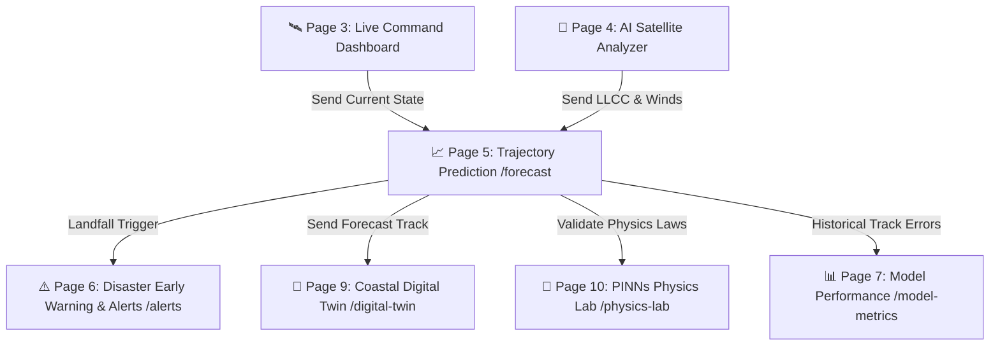

# 📈 CYCLO-AI: Page 5 — Trajectory & Intensity Prediction Center (`/forecast`)

**Project Topic:**  
> *"To develop an Artificial Intelligence (AI) / Machine Learning (ML) based system for identification, classification, and prediction of different tropical cyclone patterns using multi-source satellite data."*

**Document Scope:** Complete Architectural, Technical, Mathematical, and Functional Specification of **Page 5: Trajectory & Intensity Prediction Center**.

---

## 🗺️ 1. Navigation Flow & System Context

Page 5 is the predictive engine of CYCLO-AI. It ingests the current storm state (LLCC coordinates, current wind speed, and central pressure) from **Page 3 (`/dashboard`)** and **Page 4 (`/satellite-analyzer`)** to compute multi-day forward projections up to **120 hours**, calculate landfall coordinates, evaluate Rapid Intensification (RI) probabilities, and benchmark AI predictions against global numerical models (ECMWF, IMD-GFS, WRF).



---

## 📐 2. Visual Layout & Wireframe Architecture

The page is configured as a dual-pane tactical interface: **Top Horizon Bar**, **Left Trajectory GIS Map with Cone of Uncertainty & Landfall Pin**, and **Right Multi-Chart Intensity & NWP Benchmark Suite**.

```
┌──────────────────────────────────────────────────────────────────────────────────────────────────────────────────┐
│ [CYCLO-AI FORECAST] [Storm: MOCHA ▼] [Horizon: +6h | +12h | +24h | +48h | +72h | +120h] [Mode: AI + NWP ▼]      │
├─────────────────────────────────────────────────────────────────────────────────┬────────────────────────────────┤
│ ┌─────────────────────────────────────────────────────────────────────────────┐ │ 📊 INTENSITY & NWP BENCHMARKS  │
│ │ 🗺️ TRAJECTORY & LANDFALL MAP CANVAS                                         │ │ ┌────────────────────────────┐ │
│ │                                                                             │ │ │ RAPID INTENSIFICATION (RI) │ │
│ │                  (Odisha / West Bengal Coastline)                           │ │ │ Probability: 78.4% (HIGH)  │ │
│ │                                                                             │ │ └────────────────────────────┘ │
│ │                             [📍 Landfall: Puri Coast]                       │ │ Wind Speed Forecast (V_max): │
│ │                                  (T+38h 15m)                                │ │ 220 ──┬──────────────╭────── │
│ │                                  /          \                               │ │ 180 ──┼──────╭───────╯ (Peak)│
│ │               Cone of           /   Dashed   \                              │ │ 140 ──┼──────╯ [AI: 210 km/h]│
│ │             Uncertainty        /    AI Track  \                             │ │ km/h  0h   24h   48h   72h   │
│ │                               /       *        \                            │ │                              │
│ │         [Solid Past Line] ───* (Now: 16.2°N)    \                           │ │ Central Pressure Drop (P_c): │
│ │                              \                  /                           │ │ 920 ──┬──────────────╰────── │
│ │                               \                /                            │ │ 940 ──┼──────╰───────╮ (Min) │
│ │                                ───────────────                              │ │ hPa   0h   24h   48h   72h   │
│ │ 🛠️ MAP TOOLS: [⛶ Full] [🔍+] [🔍-] [🎯 Center Landfall] [⚡ Spaghetti On]   │ ├────────────────────────────────┤
│ └─────────────────────────────────────────────────────────────────────────────┘ │ 🌐 NWP MODEL COMPARISON MATRIX│
│ ┌─────────────────────────────────────────────────────────────────────────────┐ │ ┌──────────┬──────┬─────────┐│
│ │ ⏱️ LANDFALL COUNTDOWN & DYNAMICS BANNER                                     │ │ │ Model    │ 24h  │ Landfall││
│ │ Target: Puri District (20.1°N, 85.8°E) | Window: ±3.5h | Surge: +3.2m       │ │ ├──────────┼──────┼─────────┤│
│ │ ⏳ COUNTDOWN: 01 Day 14 Hours 22 Minutes 18 Seconds                         │ │ │ CYCLO-AI │ 38km │ Puri    ││
│ └─────────────────────────────────────────────────────────────────────────────┘ │ │ ECMWF    │ 54km │ Paradip ││
│                                                                                 │ │ IMD-GFS  │ 62km │ Chandb. ││
│                                                                                 │ │ NCMRWF   │ 71km │ Gopalp. ││
│                                                                                 │ └──────────┴──────┴─────────┘│
│                                                                                 ├────────────────────────────────┤
│                                                                                 │ 📥 EXPORT & PIPELINE HANDOFF   │
│                                                                                 │ [ ⚠️ Broadcast Warning to Alerts]│
│                                                                                 │ [ 🌊 Simulate Street Flooding ]│
│                                                                                 │ [ 💾 Export Track (GeoJSON/SHP)│
└─────────────────────────────────────────────────────────────────────────────────┴────────────────────────────────┘
```

---

## 🧩 3. Section-by-Section Feature Specifications

### Section A: Forecast Horizon & Scenario Selector
* **Component ID:** `#forecast-horizon-bar`
* **Styling:** Top pill selector with interactive forecast steps:
  * `+6h`, `+12h`, `+24h` (Tactical evacuation warning window)
  * `+48h`, `+72h` (Strategic resource prepositioning window)
  * `+120h` (Full 5-day synoptic outlook)
* **Prediction Mode Switcher:**
  * **Deterministic AI Mode:** Single high-confidence trajectory computed by the physics-informed neural network.
  * **Ensemble Dispersion Mode:** 30 perturbation members displayed as a probabilistic spaghetti plot.
  * **AI vs. NWP Benchmark Mode:** Overlays the AI trajectory directly against operational numerical weather models (ECMWF, GFS, WRF).

---

### Section B: Trajectory Map & Cone of Uncertainty
* **Component ID:** `#trajectory-gis-canvas`
* **Engine:** Leaflet / MapLibre GL with WebGL polygon rasterizers.
* **Key Visual Elements:**
  * **Past Observed Track:** Solid, thick polyline with historical 6-hour interval waypoints showing past storm track.
  * **AI Projected Trajectory:** Dashed neon cyan line (`#00F2FE`) with circular waypoints at $+6\text{h}$ intervals.
  * **Cone of Uncertainty Polygon:**
    * Semi-transparent radial polygon (`rgba(0, 242, 254, 0.15)`) representing the $67\%$ to $90\%$ probability dispersion zone.
    * Formulated using empirical forecast cross-track error expansion:
      $$\sigma(t) = \alpha \cdot t^\beta$$
      where error radius grows from $\sim 35\text{ km}$ at $+24\text{h}$ to $\sim 140\text{ km}$ at $+72\text{h}$.
  * **Landfall Marker & Coastal Intercept:**
    * Flashing dual-ring beacon (`#FF5E36`) pinned to the precise coastal coordinates of projected landfall.
    * Displays coastal district, state, and geographic coordinates (e.g., *Puri Coast, Odisha — $19.81^\circ\text{N}, 85.83^\circ\text{E}$*).
  * **Dynamic Landfall Countdown Clock:**
    * Live ticking clock showing exact remaining time in Days, Hours, Minutes, and Seconds until eye crosses coastline.

---

### Section C: Intensity Forecast & Rapid Intensification (RI) Studio
* **Component ID:** `#intensity-analytics-panel`
* **Outputs & Charts:**
  1. **Wind Speed ($V_{max}$) Forecast Curve:**
     * Temporal graph ($t+0\text{h}$ to $t+120\text{h}$) showing projected peak sustained winds ($km/h$ & $knots$).
     * Features upper and lower $90\%$ confidence intervals (shaded confidence envelope).
     * Peak intensity badge (e.g., *Peak: 215 km/h at T+36h - Super Cyclonic Storm*).
  2. **Central Pressure ($P_c$) Timeline:**
     * Inverse pressure curve tracking barometric deepening down to storm maturity ($926\text{ hPa}$).
  3. **Rapid Intensification (RI) Probability Gauge:**
     * Circular radial gauge indicating likelihood of Rapid Intensification (defined by WMO/IMD as a wind speed increase of $\ge 30\text{ knots}$ / $55\text{ km/h}$ within $24\text{ hours}$).
     * Color-coded risk status: Green ($<25\%$), Amber ($25\% - 50\%$), Red/Flashing ($>50\%$).

---

### Section D: NWP Model Comparison Matrix (AI vs. Global Suites)
* **Component ID:** `#nwp-comparison-matrix`
* **Features:**
  * Displays a side-by-side benchmark table comparing the **CYCLO-AI PINN** against standard meteorological suites:
    * **CYCLO-AI:** $38\text{ km}$ mean distance error at 24h; landfall target: *Puri District*.
    * **ECMWF (European Centre):** $54\text{ km}$ error; landfall target: *Paradip*.
    * **IMD GFS (India Meteorological Dept):** $62\text{ km}$ error; landfall target: *Chandbali*.
    * **NCMRWF Unified Model:** $71\text{ km}$ error; landfall target: *Gopalpur*.
  * **"Spaghetti Plot" Overlay Toggle:** Renders each model's forecast line on the map canvas simultaneously using distinct brand colors for visual comparison.

---

### Section E: Pipeline Handoff & Scientific Export Center
* **Component ID:** `#forecast-action-panel`
* **Integrations:**
  * **"Broadcast Warning to Alerts" Button:** Pushes calculated landfall time, peak wind speed, and affected districts directly to Page 6 (`/alerts`) to generate automated warning bulletins.
  * **"Simulate Street Flooding" Button:** Passes projected storm surge height and landfall coordinates into Page 9 (`/digital-twin`) to run 3D street-level flood inundation simulations.
  * **"Validate in PINNs Lab" Button:** Opens Page 10 (`/physics-lab`) to test alternative sea surface temperature scenarios.
  * **Multi-Format GIS Exporter:** Downloads projected waypoints, uncertainty cones, and wind envelopes as **GeoJSON**, **CSV**, or **ESRI Shapefile archive (`.zip`)**.

---

## 🎛️ 4. Exhaustive Matrix of Buttons & Interactive Controls on Page 5

| # | UI Element / Control Name | Location / Section | Element Type | Normal / Hover Styling | On-Click / Interaction Action | Target Destination / Output |
| :-: | :--- | :--- | :--- | :--- | :--- | :--- |
| **1** | **Storm Selector Dropdown** | Top Bar (Left) | Select Menu | Slate `#0F1B2F` + Cyan border | Switches active storm forecast | Updates map and intensity charts |
| **2** | **Horizon Selector (+6h to +120h)**| Top Bar (Center) | Segmented Pill Bar | Active: Cyan gradient fill | Sets maximum forecast time horizon | Adjusts trajectory line & chart range |
| **3** | **Mode Selector (AI vs NWP)**| Top Bar (Right) | Select Menu | Monospace glass dropdown | Toggles between AI-only and Multi-NWP | Updates map layer overlays |
| **4** | **Spaghetti Plot Toggle** | Map Tools | Icon Toggle Button | Active: Cyan highlight | Overlays ECMWF, GFS, and WRF lines | Toggles multi-model polylines |
| **5** | **Center on Landfall** | Map Tools | Icon Button (Crosshair)| Slate glass square button | Smooth-pans GIS camera to landfall pin | Camera Pan/Zoom animation |
| **6** | **Uncertainty Cone Toggle**| Map Tools | Checkbox Toggle | Cyan checkbox when active | Toggles visibility of the confidence cone| Toggles polygon layer opacity |
| **7** | **Zoom In (`+`)** | Map Tools | Icon Button | Slate glass square button | Increments map zoom level | GIS Viewport Zoom |
| **8** | **Zoom Out (`-`)** | Map Tools | Icon Button | Slate glass square button | Decrements map zoom level | GIS Viewport Zoom |
| **9** | **Fullscreen Map Toggle** | Map Tools | Icon Button | Slate glass square button | Maximizes forecast map to full screen | Browser Fullscreen API |
| **10**| **Landfall Marker Pin** | Map Canvas | Interactive SVG Pin | Pulsing Red/Coral beacon | Opens comprehensive landfall modal | Modal (Time, Surge, Winds) |
| **11**| **Trajectory Waypoint Pins**| Map Canvas | Circular Dot Markers | Small Cyan rings with timestamp | Displays speed and coordinates at that hour | Waypoint Tooltip ($V_{max}, P_c$) |
| **12**| **Wind Chart Metric Toggle** | Intensity Panel | Segmented Button | `km/h` $\leftrightarrow$ `knots` | Toggles unit of measurement | Updates chart Y-axis scale |
| **13**| **RI Threshold Inspector** | Intensity Panel | Interactive Gauge | Red flashing glow when $>50\%$ | Pops up feature attribution for RI | Modal (SST, Vertical Wind Shear) |
| **14**| **NWP Model Checkboxes** | Comparison Matrix | Checkbox Group | Color-coded per model | Enables/disables individual model tracks | Filter on-canvas spaghetti lines |
| **15**| **"Broadcast to Alerts" CTA**| Pipeline Actions | Primary Action Button | Hazard Coral gradient (`#FF5E36`)| Transfers forecast payload to Page 6 | `/alerts?storm=mocha&auto=true` |
| **16**| **"Simulate Flooding" CTA** | Pipeline Actions | Secondary Action Button | Deep Cyan gradient (`#0E3D59`) | Hands off storm surge to Digital Twin | `/digital-twin?surge=3.2m` |
| **17**| **"Export GeoJSON" Button** | Export Center | Outlined Action Button| Slate glass with download icon | Generates standard GeoJSON track | File Download (`forecast_track.geojson`)|
| **18**| **"Export Shapefile" Button**| Export Center | Outlined Action Button| Slate glass with download icon | Packages track & cone into `.shp.zip` | File Download (`forecast_shp.zip`) |
| **19**| **"Export CSV Table" Button**| Export Center | Outlined Action Button| Slate glass with download icon | Downloads table of hourly coordinates | File Download (`track_waypoints.csv`) |
| **20**| **"Test in Physics Lab" Link**| Pipeline Actions | Ghost Text Link | Underline on hover | Opens PINNs sandbox with current storm | `/physics-lab?storm=mocha` |

---

## 🎨 5. Applied Design System & Visual Tokens

Page 5 adheres to the **Golden Ratio 60-30-10** color palette tailored for multi-model trajectory analytics:

* **60% Base Tactical Canvas (`--color-canvas-primary`):** `#050B14` (Deep navy void ensuring high visual clarity for multi-line trajectories).
* **30% Analytical Surfaces & Cards (`--color-canvas-surface`):** `#0F1B2F` and `#0E3D59` with `backdrop-filter: blur(14px)` and `1px solid rgba(0, 242, 254, 0.18)`.
* **10% Brand Accents & Multi-Model Palette:**
  * **CYCLO-AI Trajectory (`--color-brand`):** `#00F2FE` (Electric Cyan dashed line with glowing outer drop-shadow).
  * **Landfall & Critical Alert (`--color-critical`):** `#FF5E36` (Hazard Coral for landfall pin and RI danger alerts).
  * **ECMWF Track Line:** `#FF9800` (Amber/Orange).
  * **IMD-GFS Track Line:** `#00E676` (Emerald Green).
  * **NCMRWF/WRF Track Line:** `#E040FB` (Magenta).

---

## 📐 6. Mathematical Formulation for AI Trajectory & Error Bounds

### 1. Physics-Informed Neural Network (PINN) Loss
The forward trajectory is optimized by penalizing unphysical accelerations using atmospheric momentum equations:
$$\mathcal{L}_{\text{total}} = \mathcal{L}_{\text{data}} + \lambda_1 \mathcal{L}_{\text{Navier-Stokes}} + \lambda_2 \mathcal{L}_{\text{Coriolis}} + \lambda_3 \mathcal{L}_{\beta\text{-drift}}$$

### 2. Empirical Cone of Uncertainty Radius
At forecast lead time $t$ (in hours), the semi-major radius of the uncertainty polygon $R(t)$ is defined as:
$$R(t) = R_0 + \gamma \cdot t^{1.15}$$
where $R_0 = 15\text{ km}$ represents initial observation uncertainty and $\gamma$ is calibrated from historical validation errors.

---
*Maintained as the official Page 5 Technical Specification for CYCLO-AI (SIH 2026).*
