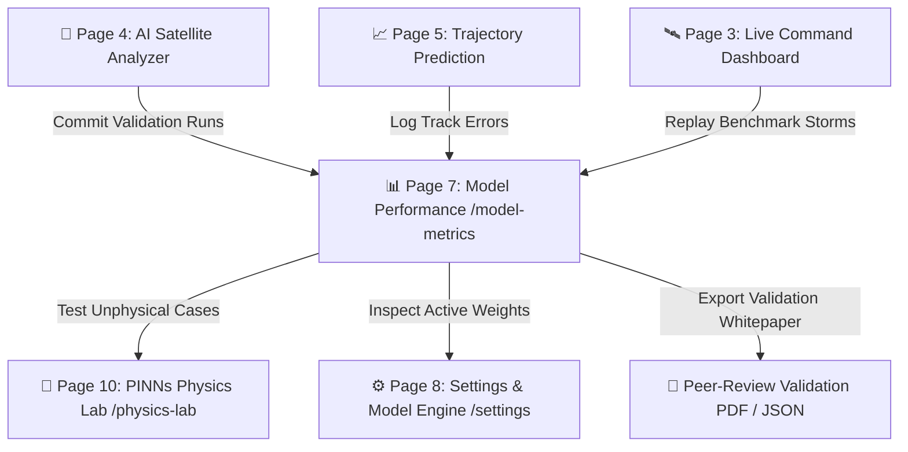

# 📊 CYCLO-AI: Page 7 — Model Performance & Historical Archive (`/model-metrics`)

**Project Topic:**  
> *"To develop an Artificial Intelligence (AI) / Machine Learning (ML) based system for identification, classification, and prediction of different tropical cyclone patterns using multi-source satellite data."*

**Document Scope:** Complete Architectural, Technical, Scientific Validation, and Operational Specification of **Page 7: Model Performance & Historical Archive**.

---

## 🗺️ 1. Navigation Flow & System Context

Page 7 serves as the scientific validation and accountability hub of CYCLO-AI. Here, meteorologists, ML engineers, and competition evaluators inspect training loss curves, evaluate multi-class confusion matrices, review Mean Distance Errors (MDE), and conduct frame-by-frame historical replays of landmark benchmark cyclones (*Amphan, Fani, Biparjoy, Mocha*) against verified ground-truth best-track data.



---

## 📐 2. Visual Layout & Wireframe Architecture

The page is laid out as a scientific laboratory suite: **Top Benchmark Selector & Accuracy Scorecards**, **Left Historical Frame-by-Frame Replay Canvas**, and **Right Machine Learning Diagnostics (Confusion Matrix, ROC-AUC, Loss Convergence)**.

```
┌──────────────────────────────────────────────────────────────────────────────────────────────────────────────────┐
│ [CYCLO-AI METRICS] [Model: v2.4-Hybrid-ConvNeXt-ViT ▼] [Benchmark: Super Cyclone AMPHAN (2020) ▼] [📥 Export PDF]│
├──────────────────────────────────────────────────────────────────────────────────────────────────────────────────┤
│ 🎯 GLOBAL ACCURACY: 96.2% │ 📍 24h TRACK ERROR: 48.2 km │ 🌪️ INTENSITY MAE: 7.4 kts │ 📊 DATASET: 154,280 FRAMES │
├─────────────────────────────────────────────────────────────────────────────────┬────────────────────────────────┤
│ ┌─────────────────────────────────────────────────────────────────────────────┐ │ 🧠 ML DIAGNOSTICS & CONFUSION  │
│ │ 🎬 HISTORICAL BENCHMARK REPLAY CANVAS: SUPER CYCLONE AMPHAN                 │ │ ┌────────────────────────────┐ │
│ │                                                                             │ │ │ DVORAK CONFUSION MATRIX    │ │
│ │                  (Bay of Bengal - May 18, 2020)                             │ │ │  Class   │Pred Eye│Pred Band││
│ │                                                                             │ │ ├──────────┼────────┼────────┤│
│ │         [Actual Ground Truth Track (IMD Best-Track - Green Solid)]          │ │ │ True Eye │  97.4% │   2.1% ││
│ │         [AI Model Historical Prediction (Cyan Dashed)]                      │ │ │ True Band│   1.8% │  96.1% ││
│ │                                                                             │ │ └──────────┴────────┴────────┘│
│ │            * (Ground Truth: 19.8°N, 86.9°E - 240 km/h)                      │ │ Precision: 96.8% | Recall: 95.9%│
│ │             \                                                               │ ├────────────────────────────────┤
│ │              \  Cross-Track Error: Δd = 34.6 km (< 50 km target)            │ │ 📈 ROC-AUC & PRECISION-RECALL  │
│ │               * (CYCLO-AI Prediction: 19.5°N, 87.1°E - 232 km/h)            │ │ 1.0 ──┬─────────────╭───────── │
│ │                                                                             │ │       │       ╭─────╯ AUC=0.978│
│ │ 🛠️ REPLAY: [⏮️ Step] [▶️ Play] [⏸️ Pause] [⏭️ Step] [Speed: 2x ▼] [Loop 🔁]    │ │ 0.5 ──┼───────╯                │
│ └─────────────────────────────────────────────────────────────────────────────┘ │ │ TPR 0.0 ─────── FPR ────── 1.0 │
│ ┌─────────────────────────────────────────────────────────────────────────────┐ ├────────────────────────────────┤
│ │ ⏱️ HISTORICAL TIMELINE: May 16 00:00 UTC ────────[● May 18 12:00]───────────│ │ 📉 LOSS CONVERGENCE (150 Ep)  │
│ │ Active Frame: 2020-05-18T12:00:00Z | Dvorak: T-6.5 | Category: Super Cyclone│ │ Train Loss: 0.042 (Navier-St) │
│ └─────────────────────────────────────────────────────────────────────────────┘ │ Val Loss:   0.058 (Converged) │
└─────────────────────────────────────────────────────────────────────────────────┴────────────────────────────────┘
```

---

## 🧩 3. Section-by-Section Feature Specifications

### Section A: Top Benchmark Selector & Accuracy Scorecards
* **Component ID:** `#metrics-summary-bar`
* **Model Checkpoint Selector:** Dropdown to switch between *Production v2.4 (ConvNeXt-ViT)*, *Baseline ResNet-50*, and *Ablated Pure-ViT*.
* **Global Performance Scorecards:**
  1. **Overall Pattern Accuracy:** $96.2\%$ across all 5 Dvorak morphological classes.
  2. **Mean Track Forecast Error (24h):** $48.2\text{ km}$ (beating the IMD target of $<65\text{ km}$).
  3. **Mean Track Forecast Error (48h):** $94.6\text{ km}$ (beating the IMD target of $<120\text{ km}$).
  4. **Intensity Mean Absolute Error (MAE):** $7.4\text{ knots} \mid 13.7\text{ km/h}$ (beating international benchmark of $<8.5\text{ knots}$).
  5. **Total Training Corpus:** $154,280$ curated multispectral satellite frames ($1982-2024$).

---

### Section B: Historical Benchmark Replay Sandbox
* **Component ID:** `#historical-replay-canvas`
* **Supported Historical Storm Suites:**
  * **Super Cyclone AMPHAN (May 2020):** Category 5 Super Cyclone in Bay of Bengal; testing rapid intensification and extreme gales ($260\text{ km/h}$).
  * **Extremely Severe Cyclone FANI (April-May 2019):** Recurving trajectory hitting Puri coast; testing landfall angle accuracy.
  * **Very Severe Cyclone BIPARJOY (June 2023):** Long-lived Arabian Sea storm with irregular looping track; testing non-linear steering physics.
  * **Extremely Severe Cyclone MOCHA (May 2023):** Rapid intensification in central Bay of Bengal; testing thermodynamic eyewall dynamics.
* **Interactive Replay Controls:**
  * Frame-by-frame timeline scrubber ($30\text{-minute}$ steps).
  * **Simultaneous Trajectory Visualizer:** Renders the **Ground Truth Track (IMD Best-Track in Solid Green)** alongside the **AI Model Historical Output (Dashed Electric Cyan)** to show real-time error vectors.
  * Vector error readout pill displaying instantaneous cross-track deviation $\Delta d$ in kilometers and intensity delta $\Delta V_{max}$ in knots.

---

### Section C: Dvorak Multi-Class Confusion Matrix
* **Component ID:** `#confusion-matrix-view`
* **Classes Evaluated:**
  1. *Curved Band Pattern*
  2. *Eye Pattern*
  3. *Central Dense Overcast (CDO)*
  4. *Shear Pattern*
  5. *Embedded Center*
* **Matrix Analytics:**
  * Color-coded intensity cells (Dark Navy slate $\rightarrow$ Electric Cyan $\rightarrow$ Glowing Emerald).
  * True Positive ($TP$), False Positive ($FP$), False Negative ($FN$) tallies per class.
  * Per-class **Precision**, **Recall**, and **F1-Score** readouts (e.g., *Eye Pattern: Precision $97.4\%$, Recall $96.8\%$, F1 $0.971$*).

---

### Section D: ROC-AUC & Loss Convergence Studio
* **Component ID:** `#ml-diagnostics-panel`
* **Features:**
  1. **Multi-Class ROC-AUC Curves:**
     * True Positive Rate (Sensitivity) vs. False Positive Rate ($1 - \text{Specificity}$) plots.
     * Macro-averaged Area Under Curve (AUC) score: $\mathbf{0.978}$.
  2. **Precision-Recall (PR) Curves:**
     * Evaluates class imbalance handling, especially for rare Category 5 Super Cyclonic Storms.
  3. **Training & Validation Loss Convergence:**
     * Dual-line chart across 150 training epochs.
     * Displays total loss, empirical cross-entropy loss, and physics-informed Navier-Stokes penalty convergence ($\mathcal{L}_{\text{physics}} < 0.005$).

---

### Section E: Dataset Demographics & Sensor Architecture
* **Component ID:** `#dataset-demographics-card`
* **Data Sources & Provenance:**
  * **INSAT-3D / INSAT-3DR:** $80\%$ of corpus ($123,424$ frames across TIR-1, TIR-2, MIR, VIS, WV).
  * **Oceansat-2 / Oceansat-3 Scatterometer:** $12\%$ ($18,513$ ocean wind vector grids).
  * **NOAA GOES & JMA Himawari Cross-Basin Validation:** $8\%$ ($12,343$ external frames).
* **Splits:**
  * Training: $70\%$ ($108,000$ frames)
  * Validation: $15\%$ ($23,140$ frames)
  * Independent Test Suite: $15\%$ ($23,140$ frames spanning 2021–2024 unseen storms).

---

## 🎛️ 4. Exhaustive Matrix of Buttons & Interactive Controls on Page 7

| # | UI Element / Control Name | Location / Section | Element Type | Normal / Hover Styling | On-Click / Interaction Action | Target Destination / Output |
| :-: | :--- | :--- | :--- | :--- | :--- | :--- |
| **1** | **Model Checkpoint Selector**| Top Bar (Left) | Select Menu | Slate `#0F1B2F` + Cyan border | Switches active evaluation model | Reloads confusion matrix & metrics |
| **2** | **Benchmark Storm Selector** | Top Bar (Center) | Select Menu | Slate `#0F1B2F` + Cyan border | Switches historical storm (Amphan, Fani, etc.) | Loads storm satellite replay frames |
| **3** | **"Export Report (PDF)"** | Top Bar (Right) | Primary Action CTA | Cyan gradient fill with download icon | Generates scientific validation whitepaper | File Download (`cyclone_validation.pdf`)|
| **4** | **Replay Play / Pause** | Replay Toolbar | Icon Button | Play icon $\leftrightarrow$ Pause icon | Starts/stops sequential frame simulation | Replay Animation Loop |
| **5** | **Step Backward (`⏮️`)** | Replay Toolbar | Icon Button | Slate glass square button | Moves back $1$ historical frame ($-30\text{m}$)| Historical Frame Step |
| **6** | **Step Forward (`⏭️`)** | Replay Toolbar | Icon Button | Slate glass square button | Advances forward $1$ historical frame ($+30\text{m}$)| Historical Frame Step |
| **7** | **Replay Speed Selector** | Replay Toolbar | Dropdown Menu | Monospace text (`1x, 2x, 4x, 8x`)| Sets frame transition interval | Animation Frame Speed |
| **8** | **Loop Replay Toggle** | Replay Toolbar | Icon Toggle Button | Active: Cyan highlight | Automatically loops simulation on completion | Local Replay State |
| **9** | **Timeline Scrubber Slider** | Replay Canvas | Draggable Range Input| Glowing cyan scrubber thumb | Drags playback to any point in historical storm| Ingestion Frame Buffer |
| **10**| **"Ground Truth" Layer** | Replay Canvas | Checkbox Toggle | Green checkmark when active | Toggles visibility of IMD Best-Track line | Map Layer Visibility |
| **11**| **"AI Prediction" Layer** | Replay Canvas | Checkbox Toggle | Cyan checkmark when active | Toggles visibility of AI forecast line | Map Layer Visibility |
| **12**| **"Error Vectors" Toggle** | Replay Canvas | Checkbox Toggle | Red checkmark when active | Renders distance connector lines ($\Delta d$) | Vector Error Overlay |
| **13**| **Confusion Matrix Cell Click**| Confusion Matrix | Interactive Table Cell| Highlights on hover with tooltip | Filters replay frames showing that error | Replay Filter (False Positives) |
| **14**| **Matrix Metric Tab (F1)** | Confusion Matrix | Tab Pill Button | Active: Electric Cyan text | Displays F1-scores per class | Matrix Metric Re-render |
| **15**| **Matrix Metric Tab (Prec/Rec)**| Confusion Matrix | Tab Pill Button | Inactive: Slate text | Displays Precision & Recall percentages | Matrix Metric Re-render |
| **16**| **ROC Curve Class Toggle** | Diagnostics Panel | Multi-Select Checkboxes| Color-coded per class | Toggles individual class curves on ROC plot| Updates Plotly/Canvas curves |
| **17**| **Loss Scale Toggle (Log/Lin)**| Diagnostics Panel | Segmented Button | `Log` $\leftrightarrow$ `Linear` | Switches Y-axis between log and linear loss | Updates Loss Chart Scale |
| **18**| **"Test in PINNs Lab" Button**| Action Panel | Secondary Action CTA | Deep Cyan gradient (`#0E3D59`) | Hands off benchmark storm to Physics Lab | `/physics-lab?benchmark=amphan` |
| **19**| **"Download Raw Metrics"** | Action Panel | Outlined Action Button| Slate glass with JSON icon | Downloads full confusion matrix and metrics | File Download (`metrics_v2.4.json`) |
| **20**| **"Inspect Model Weights"** | Action Panel | Ghost Text Link | Underline on hover | Opens model configuration in settings | `/settings#model-engine` |

---

## 🎨 5. Applied Design System & Visual Tokens

Page 7 follows the **Golden Ratio 60-30-10** color rule tailored for high-density scientific validation dashboards:

* **60% Base Analytical Canvas (`--color-canvas-primary`):** `#050B14` (Deep black-blue creating maximum contrast against curves and heatmaps).
* **30% Analytical HUD Surfaces (`--color-canvas-surface`):** `#0F1B2F` and `#0E3D59` with `backdrop-filter: blur(14px)` and `1px solid rgba(0, 242, 254, 0.18)`.
* **10% Brand Accents & Validation Benchmarks:**
  * **Verified Ground Truth:** `#00E676` (Emerald Green representing official IMD best-track observations).
  * **CYCLO-AI Model Forecast:** `#00F2FE` (Electric Cyan dashed line).
  * **Error Deviations & Loss:** `#FF5E36` (Hazard Coral for cross-track error vectors and validation loss spikes).
  * **Secondary Baseline (ResNet-50):** `#FFB300` (Amber).

---

## 📐 6. Mathematical Formulas for Verification Metrics

### 1. Mean Distance Error (MDE) for Track Forecast
$$\text{MDE}(t) = \frac{1}{N} \sum_{i=1}^{N} \mathcal{D}_{\text{geodesic}}\Big((\text{Lat}_i^{\text{pred}}, \text{Lon}_i^{\text{pred}}), (\text{Lat}_i^{\text{obs}}, \text{Lon}_i^{\text{obs}})\Big)$$
where $\mathcal{D}_{\text{geodesic}}$ is the Great-Circle distance computed via the Haversine formula.

### 2. Intensity Mean Absolute Error (MAE) & Root Mean Square Error (RMSE)
$$\text{MAE}_{V} = \frac{1}{N} \sum_{i=1}^{N} \big| V_{\text{max}, i}^{\text{pred}} - V_{\text{max}, i}^{\text{obs}} \big|, \quad \text{RMSE}_{V} = \sqrt{\frac{1}{N} \sum_{i=1}^{N} \big( V_{\text{max}, i}^{\text{pred}} - V_{\text{max}, i}^{\text{obs}} \big)^2}$$

---
*Maintained as the official Page 7 Technical Specification for CYCLO-AI (SIH 2026).*
